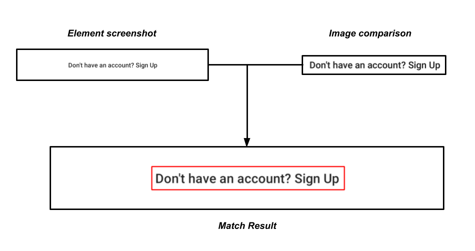

# Py-TestUI Framework

# Installation

Py-TestUI can be installed via `pip`

```bash
pip3 install git+https://github.com/testdevlab/Py-TestUI@v1.0.6
```

Or if you prefer `requirements.txt`, you can add the following dependecy

```
git+https://github.com/testdevlab/Py-TestUI@v1.0.6
```

# Appium driver

You can create `TestUIDriver` for Appium automation like so:

```py
driver: TestUIDriver = (
    NewDriver()
    .set_app_path("app.apk")
    .set_app_package_activity("com.package.package", "com.activity.Activity")
    .set_logger("pytest")
    .set_appium_driver()
)
```

By default it takes the first connected device to your machine, but you can specify device by calling `.set_udid("udid")` before the `.set_appium_driver()` call.

# Selenium Desktop driver

Py-TestUI supports the following browser drivers:

- Google Chrome
- Mozzila Firefox
- Safari
- Microsoft Edge
- Microsoft Internet Explorer
- Opera
- PhantomJS

> All these drivers must be installed and added to you `$PATH` variable

> Mozzila Firefox is downloaded automatically and added to `$PATH` but
> double-check that you have installed
> [Python certificates if you are using macOS](https://stackoverflow.com/a/53310545/13179904)

You can create `TestUIDriver` for Selenium Desktop automation like so

```python
driver: TestUIDriver = (
    NewDriver()
    .set_logger("pytest")
    .set_soft_assert(True)
    .set_selenium_driver()
)
```

# Configuration

Py-TestUI allows configuring the following default global parameters

- `screenshot_path: str` - sets default path where screenshot will be saved (default: project root directory).
- `save_screenshot_on_fail: bool` - sets whether save screenshot on failure (default: `True`)
- `save_full_stacktrace: bool` - sets whether save full stacktrace for error (defualt: `True`)

## Configuration via `NewDriver()`

Configuration parameters can be set while creating a new `TestUIDriver` object
like this

```py
driver: TestUIDriver = (
    NewDriver()
    .set_screenshot_path("path/to/default/screenshot/location")
    .set_save_screenshot_on_fail(False)
    .set_save_full_stacktrace(False)
    .set_selenium_driver()
)
```

## Configuration via `driver.configuration`

Another possible way to change default global parameters is to use
`configuration` attribute located under `driver: TestUIDriver` object. These
parameters can be changed like this at any point of the execution:

```py
driver.configuration.screenshot_path = "path/to/default/screenshot/location"
driver.configuration.save_screenshot_on_fail = False
driver.configuration.save_full_stacktrace = False
```

# Scripts

The automation infrastructure implements the Page Object Model (POM) pattern. This pattern calls for application elements and methods specific to a given screen to be included in the same Class. This improves maintainability as well as usability since any changes to elements in the application would only have to be edited in one place. This is an example:

```py
    class LoggedInScreen(object):
        #  Page Element Definitions
        def __init__(self, driver: TestUIDriver):
            self.driver = driver
            # Settings drawer
            self.__settings_button = e(driver, "accessibility", "Settings")
            self.__edit_profile = e(driver, "id", "textview_settings")
            self.__log_out_button = e(driver, "id", "textview_settings_drawer")
            .
            .
            .

       def click_and_check_settings(self):
            self.__settings_button.wait_until_visible().click()
            self.__log_out_button.wait_until_visible()
            self.__edit_profile.wait_until_visible()
            .
            .
            .
```

The test case scripts are in a different class. The scripts import the respective screen package along with additional packages such as PyTest. Each class has any amount of tests. All test methods start with the word “test\_” such as:

```py
    def test_add_existing_contact(self, appium_driver):
        from tests.tests_signup import TestSignUp
        username = TestSignUp().test_sign_up_flow(appium_driver)
        logged_in_page = LoggedInScreen(appium_driver)
        logged_in_page.log_out()
        .
        .
        .
```

### Element Locators Methods:

The class “Elements” implements default locator methods that are part of the Appium WedDriver package. It adds additional functionality to wait for a configurable amount of time for an element to appear and provides improved error logging. It also implements methods for scrolling and swiping. Example of locators:

```py
    def e(driver, locator_type, locator):
        """locator types: id, css, className, name, xpath,
        accessibility, uiautomator, classChain, predicate"""

        return Elements(driver, locator_type, locator)
```

Once you create the definition of the element with the static method e(driver, l_type, locator) you can start using a series of action/assertion methods that are built-in within Elements class.

Action methods are the ones meant to do something over the UI. In case the cannot be performed, they will rise an error which will show all the information needed for debugging:

```py
    element = e(driver, 'id', 'some_id')
    element.click()
    element.send_keys('send some text to input')
    element.swipe(end_y=end_y, end_x=end_x)
    element.press_hold_for(milliseconds)
    element.click_by_coordinates(x, y)
    element.swipe_until_text(text='some_text', el=e(driver, 'id', 'id_2'))  # swipes from element to the element 2
```

Assertion methods are the ones meant to check whether the UI is presented with the correct elements and values:

```py
    element = e(driver, 'id', 'some_id')
    element.wait_until_visible(seconds=10)
    element.wait_until_attribute(attr='text', text='something', seconds=10)
    element.wait_until_contains_attribute(attr='text', text='something')
    element.wait_until_contains_sensitive_attribute(attr='text', text='something')
    element.visible_for(seconds=1)  # Checks if visible along the set amount of time
    element.find_image_match('relative/path/image.png', threshold) # Takes screenshot of the element and compares with the provided image
```

This methods will rise a ElementException in case the conditions are not met.

There is one last method to check whether an element is visible or not which will not rise an error but return a boolean value which is element.is_visible().

Sometimes one locator identifies more that one single element, in which case you can choose among them by using element.get(index=0).

### Collection Methods:

Collections are defined as a list of elements, and you can perform different kind of actions over them, which will improve in performance or functionality. Such methods include finding element within the collection by visibility, or checking their visibility in parallel to improve performance or to check page load time:

```py
    collection = ee(e(driver, 'id', 'some_id'), e(driver, 'id', 'some_id_2'))
    collection.find_visible(seconds) # Returns the first found visible element
    collection.wait_until_all_visible(seconds)
    collection.wait_until_attribute([attr_1, attr_2],[value_1, value_2])
    collection.get(0) # Returns first element
```

### Image Recognition:

In some cases it is useful to check or assert whether a specific element or view is present during the automation, and for this reason, Py-TestUI includes OpenCV as one of the dependencies. You can use directly the methods from OpenCV directly, but you have also built-in methods from testUI:

```py
    # First field is the image path with wich you want to compare the device screenshot
    # Second field is the Threshold or how much alike the images should be (0.75-1 is considere high)
    # Third is if you want to rise an exception when the image is not found
    # The forth is if you want to keep the image of the matched region, which will be marked with a rectangle
    testui_driver.find_image_match('relative/path/image.png', 0.95, True, 'path/matched/image.png')

    testui_driver.click_by_image('relative/path/image.png', threshold)
```



If you want to use the compare method by using your own two images, you can use the following methods:

```
    ImageRecognition(original, comparison, threshold, device_name).compare()
    ImageRecognition(original, comparison, threshold, device_name).draw_image_match()
    ImageRecognition(original, comparison, threshold, device_name).image_original_size()
    ImageRecognition(original, comparison, threshold, device_name).image_comparison_size()
    ImageRecognition(original, comparison, threshold, device_name).get_middle_point()
```

Note: the image that you use for comparison can be a small portion of the screenshot/bigger one

### Drivers:

The testui_driver.py declares the TestUIDriver class which implements methods from the Elements class. It also implements methods such as “touch_actions” inherited from Selenium WebDriver TouchActions class.

The appium_driver.py declares the NewDriver class which implements TestUIDriver. It also implements the desired capabilities such as the location of the .apk., the Chrome or iOS drivers, and others such as the Android version.

NewDriver class is meant to generate appium or selenium drivers in a simple way, using default values when not specified, and starting appium server or retrieving chrome drivers automatically if necessary. An example of minimum code to start an appium session for Android app:

```py
    driver = NewDriver().set_app_path('app.apk') \
        .set_app_package_activity('package', 'activity') \
        .set_appium_driver()
```

Android chrome browser:

```py
    driver = NewDriver().set_chrome_driver('78.0.3904.70') \
        .set_appium_driver()
```

IOS app:

```py
    driver = NewDriver().set_platform('iOS').set_udid('udid') \
        .set_appium_driver()
```

Chrome desktop browser:

```py
    driver = NewDriver() \
        .set_selenium_driver()
```

Before setting the driver you can choose among a different stacks of class methods to add different capabilities or functionality out-of-the-box from the framework such as “soft asserts“ or “log types“. Soft asserts make the automation run even when element assertions find errors, but in the end of said automation you can include the following line to rise the errors found:

```py
    driver = NewDriver() \
        .soft_assert(true).set_selenium_driver()
    e(driver, 'id', 'fake_id').wait_until_visible(5)  # time in seconds
    driver.raise_errors()  # raise the error found with previous command
```

The driver creation and stop should be located under pytest fixtures, which works as before/after hooks. This fixtures are located under conftest.py file and you can call those functions by passing them as variables in the test cases.
