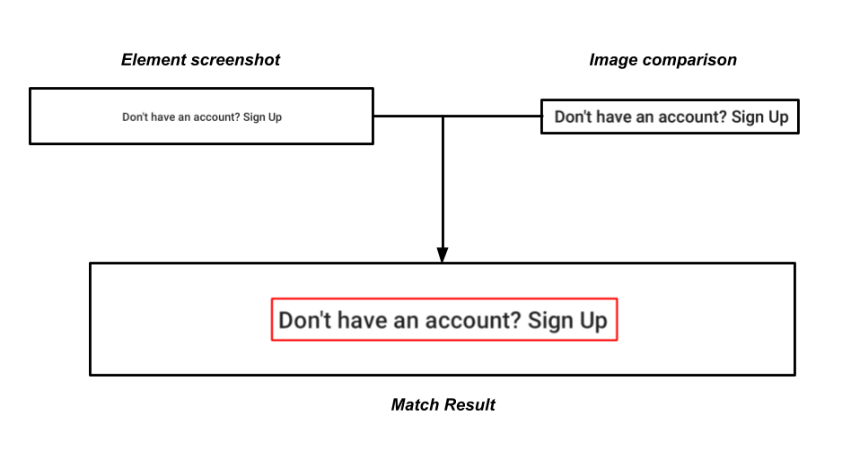

# Py-TestUI Framework [](https://pypi.org/project/python-testui/)

# Installation

```bash
pip3 install python-testui
```

Alternatively, add `python-testui~=2.0` to your `requirements.txt`.

Requirements:

- Python 3.11 or newer.
- For mobile: [Appium](https://appium.io/docs/en/latest/quickstart/) with the
  `uiautomator2` (Android) or `xcuitest` (iOS) driver. Py-TestUI starts and
  stops Appium itself. For Android, `adb` must be on `PATH` or `ANDROID_HOME`
  must be set.
- For desktop: the browser you want to test.

If you are upgrading from 1.x, see [Migrating to 2.0](#migrating-to-20).

# Migrating to 2.0

The Py-TestUI API is unchanged. Review the following before upgrading:

1. **Python 3.11 or newer** is required.
2. **Removed dependencies:** `pure-python-adb`, `imutils` and
   `geckodriver-autoinstaller` are no longer installed. If your code imports
   them, add them to your own requirements.
3. **Android:** `adb` must be on `PATH`, or `ANDROID_HOME` must be set.
4. **Bug fixes that change results:** see [Behavior fixes](#behavior-fixes).
5. **Updated libraries:** if your code uses them directly, check the notes
   below.

| Library | 1.3.0 | 2.0 |
| --- | --- | --- |
| Appium-Python-Client | `~=3.1.1` | `>=5.0.0,<7` |
| selenium | not declared | `>=4.26,<5` |
| opencv-python | `~=4.8.1` | `>=4.10.0.84,<6` |
| numpy | `~=1.26` | `>=1.26,<3` |
| pytest | `<=8.0.1` | `>=8.0,<10` |
| pytest-xdist | `~=2.5.0` | `>=3.0,<4` |
| pytest-testrail | `~=2.9.0` | `>=3.1,<4` |
| webdriver-manager | `~=4.0.1` | `>=4.0.2,<5` |
| requests | not declared | `>=2.28` |

- **Appium-Python-Client 6:** `TouchAction` and `MultiAction` are removed; use
  W3C actions or `mobile:` gestures. `keep_alive`, `direct_connection` and
  `strict_ssl` moved from `Remote()` to `AppiumClientConfig`. For an Appium 1
  server, pin `Appium-Python-Client<6`.
  [Changelog](https://github.com/appium/python-client/blob/master/CHANGELOG.md)
- **Selenium:** `FirefoxBinary` is removed.
  [Changelog](https://github.com/SeleniumHQ/selenium/blob/trunk/py/CHANGES)
- **NumPy 2 / OpenCV 5:**
  [NumPy 2 migration guide](https://numpy.org/devdocs/numpy_2_0_migration_guide.html),
  [OpenCV 5 migration notes](https://github.com/opencv/opencv/wiki/OpenCV-4-to-5-migration).
  Pin `opencv-python<5` if you need modules moved to contrib.
- **pytest 9:** in `conftest.py` hooks, use `start_path` instead of `startdir`,
  and `collection_path`, `file_path` or `module_path` instead of `path`.
- **pytest-xdist 3:** `--boxed` is removed; use pytest-forked.

## Behavior fixes

| Change | What to check |
| --- | --- |
| The parallel runner fails the run on any non-zero pytest exit code. Before, failing tests could be reported as passed (always on Windows). | Remove markers that match no tests; they now fail the run. |
| `.no()` now works with `wait_until_contains_attribute` and `wait_until_contains_sensitive_attribute`. | Tests using `.no()` with these methods. |
| `press_hold_for` holds for the given milliseconds; under 1000 ms used to be a plain tap. | Holds shorter than one second. |
| On iOS, `quit()` stops the locally started Appium server, as on Android. | Use `quit(stop_server=False)` to keep it running. |
| App sessions restart the app if it is already running, so the test starts in the app. | To keep the old behavior, use `set_extra_caps({"appium:forceAppLaunch": False})`. |
| The parallel runner deletes old Appium logs in `logs/appium_logs` at the start of a run. | Archive them first if you need them. |

To stay on 1.x, pin `python-testui<2`.

# Appium driver

Create a `TestUIDriver` for Appium automation:

```py
from testui.support.appium_driver import NewDriver
from testui.support.testui_driver import TestUIDriver

driver: TestUIDriver = (
    NewDriver()
    .set_app_path("app.apk")
    .set_app_package_activity("com.package.package", "com.activity.Activity")
    .set_logger("pytest")
    .set_appium_driver()
)
```

On Android, the first connected device is used by default. To select a device,
and always on iOS, call `.set_udid("udid")` before `.set_appium_driver()`.

# Selenium desktop driver

Py-TestUI supports the following browsers:

- Google Chrome (`"chrome"`)
- Mozilla Firefox (`"firefox"`)
- Safari (`"safari"`)
- Microsoft Edge (`"edge"`)
- Microsoft Internet Explorer (`"ie"`)

Selenium downloads the matching browser driver automatically. To use Safari,
run `safaridriver --enable` once.

Create a `TestUIDriver` for desktop browser automation:

```py
from testui.support.appium_driver import NewDriver
from testui.support.testui_driver import TestUIDriver

driver: TestUIDriver = (
    NewDriver()
    .set_logger("pytest")
    .set_soft_assert(True)
    .set_selenium_driver()
)
```

# Configuration

Py-TestUI provides the following global settings:

- `screenshot_path: str`: directory where screenshots are saved (default: the
  project root directory).
- `save_screenshot_on_fail: bool`: whether a screenshot is saved when a check
  fails (default: `True`).
- `save_full_stacktrace: bool`: whether the full stack trace is saved for
  errors (default: `True`).

## Configuration through `NewDriver()`

Settings can be applied when the driver is created:

```py
from testui.support.appium_driver import NewDriver
from testui.support.testui_driver import TestUIDriver

driver: TestUIDriver = (
    NewDriver()
    .set_screenshot_path("path/to/default/screenshot/location")
    .set_save_screenshot_on_fail(False)
    .set_save_full_stacktrace(False)
    .set_selenium_driver()
)
```

## Configuration through `driver.configuration`

Settings can also be changed at any point during execution through the
`configuration` attribute of a `TestUIDriver`:

```py
driver.configuration.screenshot_path = "path/to/default/screenshot/location"
driver.configuration.save_screenshot_on_fail = False
driver.configuration.save_full_stacktrace = False
```

# Writing tests

Py-TestUI follows the Page Object Model (POM) pattern: the elements and actions
of a screen are defined in one class, so a change in the application only needs
to be updated in one place.

```py
from testui.elements.testui_element import e
from testui.support.testui_driver import TestUIDriver


class LoggedInScreen:
    def __init__(self, driver: TestUIDriver):
        self.driver = driver
        self.__settings_button = e(driver, "accessibility", "Settings")
        self.__edit_profile = e(driver, "id", "textview_settings")
        self.__log_out_button = e(driver, "id", "textview_settings_drawer")

    def click_and_check_settings(self):
        self.__settings_button.wait_until_visible().click()
        self.__log_out_button.wait_until_visible()
        self.__edit_profile.wait_until_visible()
```

Test cases are defined in separate classes that import the screen classes. Test
method names start with `test_`:

```py
def test_log_out(self, appium_driver):
    logged_in_screen = LoggedInScreen(appium_driver)
    logged_in_screen.click_and_check_settings()
```

## Elements

The `Elements` class wraps the Appium and Selenium locator methods. It waits a
configurable amount of time for elements to appear, provides detailed error
logging, and adds scrolling and swiping. Elements are created with `e()`:

```py
def e(driver, locator_type, locator):
    """Locator types: id, css, className, name, xpath, accessibility,
    uiautomator, android_id_match, classChain, predicate"""
    return Elements(driver, locator_type, locator)
```

Action methods interact with the UI. If an action cannot be performed, an error
with the details needed for debugging is raised:

```py
element = e(driver, "id", "some_id")
element.click()
element.send_keys("text to enter")
element.swipe(end_x=end_x, end_y=end_y)
element.press_hold_for(milliseconds)
element.click_by_coordinates(x, y)
# Swipes from the element to a second element until the text appears
element.swipe_until_text(text="some_text", el=e(driver, "id", "id_2"))
```

Assertion methods check that the expected elements and values are shown:

```py
element = e(driver, "id", "some_id")
element.wait_until_visible(seconds=10)
element.wait_until_attribute(attr="text", text="something", seconds=10)
element.wait_until_contains_attribute(attr="text", text="something")
element.wait_until_contains_sensitive_attribute(attr="text", text="something")
# Checks that the element stays visible for the given time
element.visible_for(seconds=1)
# Compares a screenshot of the element with the provided image
element.find_image_match("relative/path/image.png", threshold)
```

These methods raise an `ElementException` when the condition is not met. To
check visibility without raising an error, use `element.is_visible()`, which
returns a boolean.

When a locator matches more than one element, select one with
`element.get(index=0)`.

## Collections

A collection is a list of elements that can be checked together, for example
to find the first visible element or to check that all elements are visible:

```py
from testui.elements.testui_collection import ee
from testui.elements.testui_element import e

collection = ee(e(driver, "id", "some_id"), e(driver, "id", "some_id_2"))
collection.find_visible(seconds)  # Returns the first visible element
collection.wait_until_all_visible(seconds)
collection.wait_until_attribute([attr_1, attr_2], [value_1, value_2])
collection.get(0)  # Returns the first element
```

## Image recognition

Py-TestUI includes OpenCV to check whether an image is shown on the screen. The
OpenCV API can be used directly, or through the built-in methods:

```py
# Arguments: the image to look for, the similarity threshold (0.75-1 is
# considered high), whether to raise an exception when the image is not found,
# and an optional path to save the screenshot with the match outlined
testui_driver.find_image_match(
    "relative/path/image.png", 0.95, True, "path/matched/image.png"
)

testui_driver.click_by_image("relative/path/image.png", threshold)
```



To compare two existing images, use `ImageRecognition`. The comparison image
can be a small part of the original:

```py
ImageRecognition(original, comparison, threshold, device_name).compare()
ImageRecognition(original, comparison, threshold, device_name).draw_image_match()
ImageRecognition(original, comparison, threshold, device_name).image_original_size()
ImageRecognition(original, comparison, threshold, device_name).image_comparison_size()
ImageRecognition(original, comparison, threshold, device_name).get_middle_point()
```

## Drivers

`TestUIDriver` (`testui_driver.py`) provides the driver-level methods.
`NewDriver` (`appium_driver.py`) creates Appium and Selenium drivers with
sensible defaults, sets the capabilities, and starts the Appium server or
downloads chromedriver when needed. Minimal examples:

```py
# Android app
driver = (
    NewDriver()
    .set_app_path("app.apk")
    .set_app_package_activity("package", "activity")
    .set_appium_driver()
)

# Chrome on Android
driver = NewDriver().set_chrome_driver().set_appium_driver()

# iOS app
driver = NewDriver().set_platform("ios").set_udid("udid").set_appium_driver()

# Chrome on desktop
driver = NewDriver().set_selenium_driver()
```

With soft asserts enabled, failed checks are collected instead of stopping the
test, and `raise_errors()` reports them at the end:

```py
driver = NewDriver().set_soft_assert(True).set_selenium_driver()
e(driver, "id", "fake_id").wait_until_visible(5)  # Time in seconds
driver.raise_errors()  # Raises the errors collected so far
```

Create and quit drivers in pytest fixtures, typically in `conftest.py`, and
pass the fixtures to the test methods.
